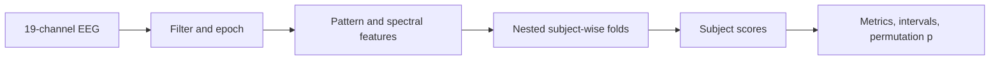
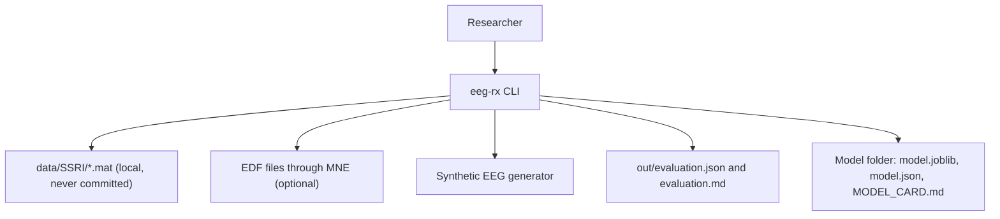
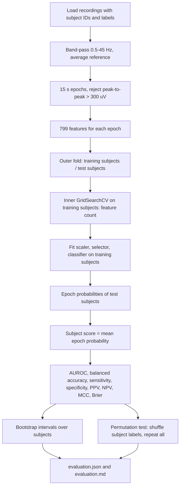

<div align="center">

# eeg-rx — EEG Biomarkers of Antidepressant (SSRI) Response

**eeg-rx is a leakage-safe research pipeline for resting-state EEG studies of SSRI treatment response. It takes 19-channel recordings through these steps to subject-level results with intervals and a permutation test:**

`load` → `filter` → `epoch` → `extract features` → `nested subject-wise evaluation` → `report`.


**[Summary](#1-summary)** ·
**[Workflow](#4-the-end-to-end-workflow)** ·
**[Run it](#14-how-to-run-eeg-rx)** ·
**[Configuration](#144-environment-variables)** ·
**[Known problems](#17-known-problems)** ·
**[Glossary](#19-glossary)**

</div>

> [!NOTE]
> This README uses ASD-STE100 Simplified Technical English. The writing rules and the project
> vocabulary are in [`docs/ste-style-guide.md`](docs/ste-style-guide.md). Each term in the
> [Glossary](#19-glossary) has only one meaning.

> [!WARNING]
> Do not use eeg-rx to choose a treatment for a person. It is a research tool. It is not a medical device, and no clinical or external validation exists.
> A clinician must make every treatment decision. Small EEG datasets contain bias from age, sex, medication, site and device.

---

eeg-rx asks one research question: do resting-state EEG features predict which patients respond to an SSRI?
The pipeline keeps the subject ID with every epoch, so no subject can be in a training fold and a test fold.
Scaling and feature selection are fit inside each fold, and each fold gets a fresh model.
The result is one score for each subject, with bootstrap intervals and a permutation test against chance.
A built-in comparison shows how much an epoch-wise protocol inflates the accuracy.

This README is the **one location that explains all of eeg-rx**. It gives these topics:

- the general design
- each component and its procedure, step by step
- the decision rules
- the data map
- the runbook
- the validation results and the known problems

| If you are… | Read |
|---|---|
| A manager or reviewer | [1](#1-summary), [3](#3-design-rules), [4](#4-the-end-to-end-workflow), [16](#16-validation-results), [18](#18-key-points) |
| A developer who joins the project | All sections, in sequence. Keep [14](#14-how-to-run-eeg-rx) and [17](#17-known-problems) open while you work |
| A researcher who runs eeg-rx | [14](#14-how-to-run-eeg-rx), then the section for the component that you use |

---

## Table of contents

1. 🧭 [Summary](#1-summary)
2. 🏗️ [How eeg-rx is built](#2-how-eeg-rx-is-built)
   - 2.1 [Components](#21-components)
   - 2.2 [System context](#22-system-context)
   - 2.3 [Repository layout](#23-repository-layout)
3. 🛡️ [Design rules](#3-design-rules)
4. 🔄 [The end-to-end workflow](#4-the-end-to-end-workflow)
   - 4.1 [Full flow](#41-full-flow)
   - 4.2 [The life cycle of one subject](#42-the-life-cycle-of-one-subject)
5. 📥 [The loaders](#5-the-loaders)
6. 🧹 [The preprocessing](#6-the-preprocessing)
7. 🔵 [The pattern histogram features](#7-the-pattern-histogram-features)
8. 🟢 [The spectral features](#8-the-spectral-features)
9. 🟣 [The model pipelines](#9-the-model-pipelines)
10. ⚖️ [The nested evaluation and the metrics](#10-the-nested-evaluation-and-the-metrics)
11. 🧪 [The leakage comparison](#11-the-leakage-comparison)
12. 🗒️ [Training, prediction and the model card](#12-training-prediction-and-the-model-card)
13. 🗂️ [Data and file map](#13-data-and-file-map)
14. ▶️ [How to run eeg-rx](#14-how-to-run-eeg-rx)
    - 14.1 [Prerequisites](#141-prerequisites) · 14.2 [Installation](#142-installation) · 14.3 [Run eeg-rx](#143-run-eeg-rx) · 14.4 [Environment variables](#144-environment-variables)
15. 🧩 [How to extend eeg-rx](#15-how-to-extend-eeg-rx)
16. ✅ [Validation results](#16-validation-results)
17. ⚠️ [Known problems](#17-known-problems)
18. 📌 [Key points](#18-key-points)
19. 📖 [Glossary](#19-glossary)
20. 📄 [License](#20-license)

---

## 1. Summary

**The problem.** A depression study has about 30 subjects and many 15 s epochs for each subject. These questions are difficult:

- How do you prevent a model that learns to identify a subject, not the treatment response?
- How do you select features without a look at the test subjects?
- How do you give one decision for each subject, not for each epoch?
- How do you show that a result is better than chance with 30 subjects?

eeg-rx gives each of these questions its own component. Each component has unit tests.

| Item | Value |
|---|---|
| Input | `SSRI_R_<n>.mat` and `SSRI_NR_<n>.mat` files (19 channels, 256 Hz), an EDF manifest, or synthetic EEG |
| Output | `evaluation.json`, `evaluation.md`, a model folder with `MODEL_CARD.md`, a responder probability for one recording |
| Components | **12** modules: config, io, preprocess, features (lbp, spectral), model, evaluate, report, train, synthetic, cli |
| Features | 608 pattern-histogram features + 191 spectral features = 799 for each epoch |
| Classifiers | Logistic regression (default), RBF SVM, small MLP |
| Offline mode | Everything. Synthetic EEG replaces the patient data |
| Safety | Subject-wise folds with a leakage check, a disclaimer on each report and prediction |
| Tests | **26** unit tests pass and **1** skips in CI (`pytest`). The skipped test needs MNE |



---

## 2. How eeg-rx is built

### 2.1 Components

| Component | Module | Purpose |
|---|---|---|
| Settings | `src/eeg_rx/config.py` | `Settings` from `EEG_RX_*` variables and CLI flags, with validation |
| Loaders | `src/eeg_rx/io.py` | `.mat` folder loader, EDF manifest loader (MNE), `Recording` validation |
| Preprocessing | `src/eeg_rx/preprocess.py` | Band-pass, optional notch, average reference, epochs, artefact rejection |
| Pattern features | `src/eeg_rx/features/lbp.py` | Vectorised 5x5 pattern codes, 32-bin histograms |
| Spectral features | `src/eeg_rx/features/spectral.py` | Band power, relative band power, frontal alpha asymmetry |
| Feature sets | `src/eeg_rx/features/__init__.py` | `extract`, `FeatureSet` with subject IDs, `.npz` save and load |
| Model pipelines | `src/eeg_rx/model.py` | Variance filter, scaler, selector, classifier, inner grid |
| Evaluation | `src/eeg_rx/evaluate.py` | Nested subject-wise folds, metrics, bootstrap, permutation test, leaky comparison |
| Report | `src/eeg_rx/report.py` | `evaluation.json`, `evaluation.md`, model card text |
| Training | `src/eeg_rx/train.py` | Final model on all subjects, save, load, predict one recording |
| Synthetic EEG | `src/eeg_rx/synthetic.py` | Subjects with fingerprints, an adjustable label effect and blinks |
| CLI | `src/eeg_rx/cli.py` | The `eeg-rx` command with 6 subcommands |

### 2.2 System context



### 2.3 Repository layout

```
eeg-rx/
├── .github/workflows/ci.yml     # CI: Python 3.11, pip install -e ".[dev]", pytest -q
├── .env.example                 # all 14 EEG_RX_* variables, empty
├── pyproject.toml               # package, extras (mne, dev), eeg-rx script
├── data/README.md               # source, terms, file layout, no-download option
├── docs/ste-style-guide.md      # writing rules and project vocabulary
├── src/eeg_rx/
│   ├── config.py  io.py  preprocess.py   # settings, loaders, filters and epochs
│   ├── features/                         # lbp.py, spectral.py, extract and FeatureSet
│   ├── model.py  evaluate.py             # pipelines, nested evaluation, permutation test
│   ├── report.py  train.py               # reports, model card, final model, prediction
│   └── synthetic.py  cli.py              # synthetic EEG and the command line
└── tests/                                # 27 tests (26 run, 1 needs MNE)
```

---

## 3. Design rules

### 3.1 No subject is in two folds
The outer loop uses `StratifiedGroupKFold` with the subject ID as the group, or leave one subject out. `check_no_subject_overlap` runs for each outer fold and raises `LeakageError` on an overlap.

### 3.2 Selection happens inside the folds
Scaling and feature selection are steps of a scikit-learn `Pipeline`. The inner `GridSearchCV` selects the feature count on the training subjects only. The test subjects of a fold never touch a fit.

### 3.3 Each fold gets a fresh model
`nested_cv` calls `clone` on the base pipeline for each outer fold. A test checks that each fit uses a new classifier object.

### 3.4 One decision for each subject
Each subject score is the mean epoch probability of that subject. All reported metrics are subject-level.

### 3.5 Every number is the computed number
`report.py` writes the values of the evaluation dict without change. A test compares the report with the computed metrics.

### 3.6 Each output says research use only
Each report, model card and prediction carries the `DISCLAIMER` text. The prediction always calls the trained model.

### 3.7 No hard-coded data sizes
The loaders count the subjects and the samples from the files. The sampling rate, the epoch length and the filter band are settings.

---

## 4. The end-to-end workflow

### 4.1 Full flow



### 4.2 The life cycle of one subject

1. The loader reads the file and gives the subject an ID and a label.
2. The preprocessing filters the recording and cuts it into 15 s epochs.
3. The rejection step removes epochs with blinks or other large artefacts.
4. The feature step gives each epoch 799 features and keeps the subject ID.
5. The outer loop puts all epochs of the subject in one test fold.
6. A model fit on the other subjects gives a probability for each epoch.
7. The mean of these probabilities is the subject score.
8. The metrics compare the subject score with the subject label.

---

## 5. The loaders

**Purpose.** Read recordings and keep the subject ID and the label with each one.

| Input | Output |
|---|---|
| A folder of `SSRI_R_<n>.mat` and `SSRI_NR_<n>.mat` files, or a CSV of EDF files | A list of `Recording` objects |

**Procedure**

1. List the files that match `SSRI_(R|NR)_<n>.mat`. Ignore other files.
2. Read the variable `EEG`. If it has the shape (samples, 19), transpose it.
3. Give the ID `R01`, `NR03` and so on, and the label 1 or 0.
4. Validate the recording.

**Rules**

- A recording must have 19 channels, at least 1 s of signal and only finite values.
- A label must be 0 or 1.
- A folder with no matching file gives `DataError`.

---

## 6. The preprocessing

**Purpose.** Make clean, equal-length epochs.

**Procedure**

1. Check that all recordings have one sampling rate.
2. Apply a 4th-order Butterworth band-pass from 0.5 Hz to 45 Hz with zero phase.
3. If a line frequency is given, apply a notch filter.
4. Subtract the mean of all channels from each channel (average reference).
5. Cut non-overlapping epochs of 15 s. Drop the incomplete end.
6. Remove each epoch in which a channel has a peak-to-peak value above 300 µV. Count the removed epochs for each subject.

---

## 7. The pattern histogram features

**Purpose.** Describe the local shape of each channel with 32 pattern codes.

**Procedure** (for each position of a 25-sample window)

1. Reshape the 25 samples into a 5x5 matrix, column by column.
2. Calculate the standard deviation of each column.
3. Subtract the column with the second-highest deviation from the column with the highest deviation.
4. Divide the column deviations by 2^0.25 to get 5 thresholds.
5. Set bit k if difference k is at or above threshold k.
6. The code is the sum of bit k × 2^k.
7. Count the codes in 32 fixed bins and divide by the window count.

**Rules**

- The comparison is element-wise. The prototype compared one value with a whole vector.
- The 32 bins are fixed (codes 0 to 31), so the histograms of all epochs have the same meaning.
- 19 channels × 32 bins = 608 features.

---

## 8. The spectral features

| Feature | Count | Definition |
|---|---|---|
| Log band power | 19 × 5 | `log10` of the Welch power (2 s segments) in delta 1–4, theta 4–8, alpha 8–13, beta 13–30, gamma 30–45 Hz |
| Relative band power | 19 × 5 | Band power / sum of the 5 band powers of the channel |
| Frontal alpha asymmetry | 1 | ln(alpha power F4) − ln(alpha power F3) |

These features are the baseline. A pattern-histogram result is useful only if it is better than this baseline.

---

## 9. The model pipelines

| Step | Default | Options |
|---|---|---|
| `variance` | `VarianceThreshold(0)` | — |
| `scale` | `StandardScaler` | — |
| `select` | `anova`: `SelectKBest(f_classif)` | `l1`: top-k by the L1 logistic coefficient, `none` |
| `clf` | `logreg`: `LogisticRegression(C=0.1, class_weight="balanced")` | `svm`: RBF `SVC` with Platt scaling (`CalibratedClassifierCV`, 3 folds), `mlp`: `MLPClassifier(32)` |

| Inner grid | Values |
|---|---|
| `anova`: `select__k` | 8, 16, 32, 64, 128, `all` (only values below the feature count) |
| `l1`: `select__max_features` | 8, 16, 32, 64, 128 |
| `none` | No grid |

The inner score is the epoch-level AUROC.

---

## 10. The nested evaluation and the metrics

**Purpose.** Give a subject-level estimate that no test subject influenced.

**Procedure**

1. Split the subjects into `outer_folds` stratified folds (default 5). `0` means leave one subject out.
2. For each outer fold, check that no subject is on both sides.
3. On the training subjects, run `GridSearchCV` with `inner_folds` subject-wise folds (default 3).
4. Refit the best pipeline on all training subjects of the fold.
5. Predict the epochs of the test subjects.
6. After all folds, calculate the subject scores.
7. Calculate the metrics at the threshold 0.5.
8. Calculate 95% intervals for AUROC and balanced accuracy with a stratified bootstrap over subjects (2,000 samples).
9. Shuffle the labels between subjects and repeat steps 1 to 6 `permutations` times (default 50).
10. Calculate p = (1 + number of null AUROC values ≥ the real AUROC) / (1 + permutations).

| Metric | Definition |
|---|---|
| AUROC | Area under the ROC curve of the subject scores |
| Balanced accuracy | (sensitivity + specificity) / 2 |
| Sensitivity, specificity | TP / (TP + FN), TN / (TN + FP) |
| PPV, NPV | TP / (TP + FP), TN / (TN + FN) |
| MCC | Matthews correlation coefficient |
| Brier | Mean squared error of the subject scores |

---

## 11. The leakage comparison

`eeg-rx leakage-demo` runs two protocols on the same features:

| Protocol | Feature selection | Folds | Unit |
|---|---|---|---|
| WRONG (the prototype protocol) | ANOVA top 32 on all epochs | 10 stratified epoch folds | Epoch accuracy |
| Correct (eeg-rx) | Inside each fold | Subject-wise nested folds | Subject metrics |

The synthetic subjects have fingerprints: channel gains and an alpha frequency of their own. The wrong protocol learns these fingerprints. Thus it reports a high accuracy also when the label has no effect.

---

## 12. Training, prediction and the model card

**Procedure**

1. `eeg-rx train` runs the inner grid on all subjects and refits the best pipeline.
2. It writes `model.joblib`, `model.json` (settings, parameters, feature names) and `MODEL_CARD.md`.
3. With `--with-evaluation`, it first runs the nested evaluation and puts the result in the model card.
4. `eeg-rx predict` loads one `.mat` recording, preprocesses it with the saved settings and extracts the features.
5. It refuses the recording if the feature names differ from the model.
6. It prints the mean epoch probability, the epoch counts and the disclaimer.

**Rules**

- The probability is a research output. It is not calibrated on an external set.
- A `.joblib` file can run code when it loads. Load only model files that you made yourself.

---

## 13. Data and file map

| Path | Committed? | Contents |
|---|---|---|
| `data/README.md` | Yes | Source, terms, layout |
| `data/SSRI/*.mat` | No (git ignores them) | Patient recordings |
| `data/synthetic/` | No (git ignores it) | Output of `eeg-rx synth` |
| `*.npz` | No (git ignores them) | Output of `eeg-rx features` |
| `out/evaluation.json`, `out/evaluation.md` | No (git ignores them) | Output of `eeg-rx evaluate` |
| `models/<name>/` | No (git ignores it) | Output of `eeg-rx train` |
| `.env.example` | Yes | All 14 variables, empty |
| `.env` | No (git ignores it) | Local settings |

---

## 14. How to run eeg-rx

### 14.1 Prerequisites

| Need | For |
|---|---|
| Python 3.11+ | All components |
| `numpy`, `scipy`, `scikit-learn` | All components (installed with the package) |
| `mne>=1.6` (extra `mne`) | EDF files only |
| Patient data with approval for research use | Real results (see `data/README.md`) |

### 14.2 Installation

```bash
git clone https://github.com/KrishnaAnnavaram/eeg-rx.git
cd eeg-rx
python -m venv .venv
. .venv/bin/activate            # Windows: .venv\Scripts\activate
pip install -e ".[dev]"         # add ,mne for EDF files
```

### 14.3 Run eeg-rx

Offline (synthetic EEG):

```bash
eeg-rx features --synthetic --out out/synthetic_features.npz
eeg-rx evaluate --features-file out/synthetic_features.npz --out out/eval
eeg-rx features --synthetic --effect 0 --out out/null_features.npz
eeg-rx leakage-demo --features-file out/null_features.npz --effect 0
eeg-rx synth --out data/synthetic
eeg-rx train --data-dir data/synthetic --out models/logreg --with-evaluation
eeg-rx predict --model-dir models/logreg --recording data/synthetic/SSRI_R_1.mat
```

With local recordings in `data/SSRI/`:

```bash
eeg-rx features --data-dir data/SSRI --out out/features.npz
eeg-rx evaluate --features-file out/features.npz --outer-folds 0 --permutations 200 --out out/eval_loso
eeg-rx evaluate --features-file out/features.npz --classifier svm --out out/eval_svm
```

### 14.4 Environment variables

| Variable | Used by | Meaning |
|---|---|---|
| `EEG_RX_DATA_DIR` | Loader | Folder with the `.mat` files. Default `data/SSRI` |
| `EEG_RX_OUT_DIR` | Report | Report folder. Default `out` |
| `EEG_RX_SEED` | Folds, models, bootstrap, permutations | Default 42 |
| `EEG_RX_SFREQ` | Loader | Sampling rate of `.mat` files. Default 256 |
| `EEG_RX_EPOCH_SECONDS` | Preprocessing | Default 15 |
| `EEG_RX_L_FREQ`, `EEG_RX_H_FREQ` | Preprocessing | Band-pass edges. Default 0.5 and 45 Hz |
| `EEG_RX_REJECT_UV` | Preprocessing | Peak-to-peak limit. Default 300. 0 turns the check off |
| `EEG_RX_FEATURES` | Features | `lbp+bandpower` (default), `lbp` or `bandpower` |
| `EEG_RX_CLASSIFIER` | Model | `logreg` (default), `svm` or `mlp` |
| `EEG_RX_SELECTOR` | Model | `anova` (default), `l1` or `none` |
| `EEG_RX_OUTER_FOLDS` | Evaluation | Default 5. 0 = leave one subject out |
| `EEG_RX_INNER_FOLDS` | Evaluation | Default 3 |
| `EEG_RX_PERMUTATIONS` | Evaluation | Default 50. 0 turns the test off |

eeg-rx uses no credentials. Keep local values in `.env`. Git ignores this file.

---

## 15. How to extend eeg-rx

| You want to… | Do this | Code change? |
|---|---|---|
| Use leave one subject out | `--outer-folds 0` | No |
| Use only the spectral baseline | `--features bandpower` | No |
| Add a feature family (for example coherence) | Add a module in `features/`, add its name to `KINDS` and to `extract` | Small |
| Add a classifier | Add a branch to `make_classifier` and a name to `CLASSIFIERS` | Small |
| Add ICA artefact removal | Add an MNE step in `preprocess.py` behind the `mne` extra | Yes |
| Add calibration | Wrap the classifier in `CalibratedClassifierCV` inside the pipeline | Small |

---

## 16. Validation results

| Validation | Result | Command |
|---|---|---|
| Unit tests | **26 passed, 1 skipped** in CI (MNE is not installed) | `pytest -q` |
| Synthetic, effect 0.2, `logreg` | AUROC 0.843 [0.662, 0.977], balanced accuracy 0.792, permutation p = 0.020 (50 shuffles) | `eeg-rx evaluate --features-file ...` |
| Synthetic, effect 0.2, `svm` | AUROC 0.806 [0.620, 0.949], balanced accuracy 0.639 | `... --classifier svm --permutations 0` |
| Synthetic, effect 0.2, `logreg` with `l1` selector | AUROC 0.870 [0.718, 0.972], balanced accuracy 0.750 | `... --selector l1 --permutations 0` |
| Synthetic, effect 0.2, `mlp` | AUROC 0.829 [0.648, 0.963], balanced accuracy 0.722 | `... --classifier mlp --permutations 0` |
| Synthetic, effect 0 (no signal), `logreg` | AUROC 0.435 [0.222, 0.662], balanced accuracy 0.458, permutation p = 0.529 | `eeg-rx evaluate --features-file <null features>` |
| Leakage comparison, effect 0 | WRONG protocol: epoch accuracy 0.889. Subject-wise: balanced accuracy 0.458 | `eeg-rx leakage-demo --effect 0` |

The synthetic data set has 30 subjects (12 responders), 120 s each. 226 epochs remained and 14 epochs were rejected for blinks.
All numbers are from SYNTHETIC EEG. They show that the pipeline finds a planted effect and gives chance level when there is no effect.
The most important line is the leakage comparison. On data with no label signal, the old protocol reports 0.889 accuracy.
The prototype reported its accuracy with the epoch-wise protocol and with a +2 offset on the plot. That result is not reproduced here, and this README gives no number for it.
No result on patient data is in this repository.

---

## 17. Known problems

Read these problems before you use eeg-rx for research.

| # | Area | Problem | Impact and action |
|---|---|---|---|
| 1 | Results | No patient-data result is reported or tested in CI | Run the nested evaluation on approved data and publish it with the seed and the permutation p |
| 2 | Sample size | About 30 subjects give wide intervals (on the synthetic data, AUROC from 0.66 to 0.98) | Report the intervals and the permutation p, not only the point value |
| 3 | Clinical use | No external validation, no calibration, no clinician review | Do not use the output for a treatment decision |
| 4 | Bias | Age, sex, medication, site and device can confound the label | Record these variables and check them before you trust a result |
| 5 | Artefacts | Only a peak-to-peak rule removes artefacts. There is no ICA | Muscle and eye artefacts below 300 µV stay in the data |
| 6 | Denoising | The prototype used multiscale PCA. eeg-rx uses a band-pass filter | Results are not directly comparable with the prototype |
| 7 | Model files | `.joblib` files use pickle | Load only model files that you made |
| 8 | Synthetic data | The synthetic effect (frontal theta and F4 alpha) is a design choice, not a known biomarker | Synthetic results test the code, not the science |

---

## 18. Key points

1. **No subject is in two folds.** Folds use subject groups, and a check raises an error on an overlap.
2. **Selection happens inside the folds.** A pipeline holds the scaler and the selector, so the test subjects never touch a fit.
3. **The result is subject-level.** Each subject gets one score, and all metrics use these scores.
4. **Chance is measured.** A permutation test repeats the full nested loop with shuffled subject labels.
5. **The bias of the old protocol is shown.** On data with no signal, it reports 0.889 accuracy. The subject-wise protocol reports 0.458.
6. **It is a research tool.** Every output says research use only.

---

## 19. Glossary

| Term | Meaning |
|---|---|
| **Band power** | The power of a channel in one frequency band |
| **Epoch** | One non-overlapping 15 s part of a recording |
| **Inner fold** | One validation group inside the training subjects of an outer fold |
| **Leaky protocol** | Feature selection on all data and epoch-wise folds, for comparison only |
| **Model card** | `MODEL_CARD.md`: the intended use, the data, the performance and the limits |
| **Nested evaluation** | Outer subject-wise folds with an inner selection loop |
| **Non-responder** | A subject with label 0 |
| **Outer fold** | One test group of subjects |
| **Pattern code** | A number from 0 to 31 from the 5x5 matrix rule |
| **Pattern histogram** | The normalised counts of the 32 pattern codes of one channel |
| **Permutation test** | The nested evaluation repeated with labels shuffled between subjects |
| **Recording** | The EEG of one subject: 19 channels at one sampling rate |
| **Responder** | A subject with label 1 |
| **Subject** | One patient with one recording and one label |
| **Subject score** | The mean epoch probability of one subject |
| **Window** | One 25-sample part of a channel that gives one pattern code |

---

## 20. License

[MIT](LICENSE) © 2026 Krishna Annavaram
